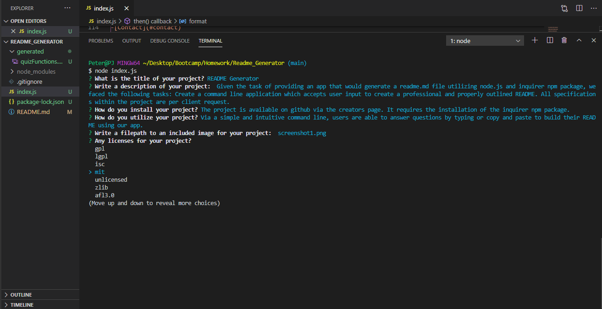

# README Generator

## Description: 
Given the task of providing an app that would generate a readme.md file utilizing node.js and inquirer npm package, wefaced the following tasks: Create a command line application which accepts user input to create a professional and properly outlined README. All specifications within the project are per client request.
## Table of Contents

-[Description](#description)

-[Installation](#installation)

-[Instructions](#instructions)

-[Licenses](#licenses)

-[Deployed](#deployed)

-[Contact](#contact)

-[Contributors](#Contributors)

-[Testing](#Tests)

## Installation:
The project is available on github via the creators page. It requires the installation of the inquirer npm package.
## Instructions:
Via a simple and intuitive command line, users are able to answer questions by typing or copy and paste to build their README using our app.
### Licenses: 

### Deployed: 
[https://github.com/boylepeter/Readme_Generator](https://github.com/boylepeter/Readme_Generator)

### Contact:

[Github](https://github.com/boylepeter/Readme_Generator)

[LinkedIn](https://www.linkedin.com/in/peter-boyle-22b5071b7/)

Email: [boyle.peter614@gmail.com](boyle.peter614@gmail.com)

### Contributors: 
None

### Tests: 
Feel free to test with your next project. Let me know if you have any questions or comments via any of the methods above in contacts.

    